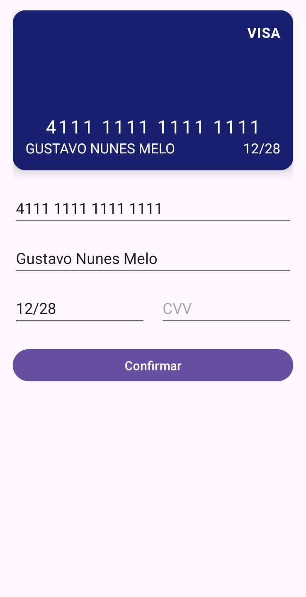
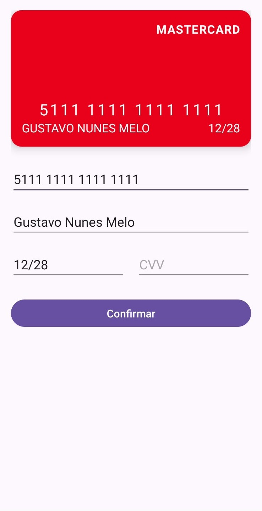
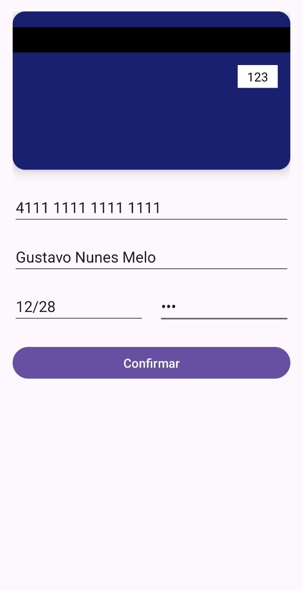
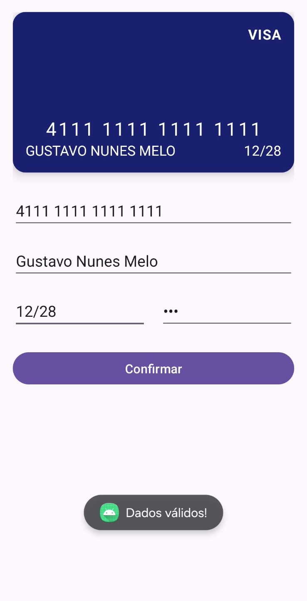
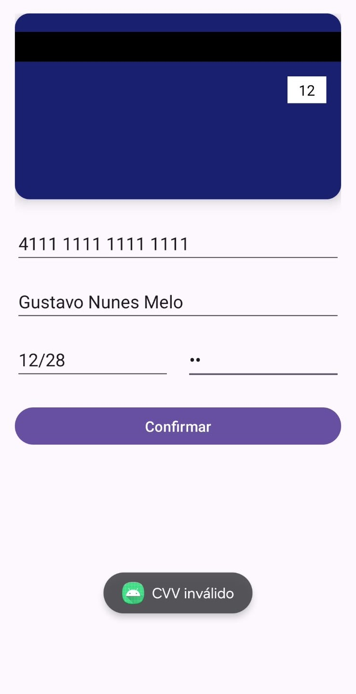

# Cartão de Crédito

Aplicativo Android em **Kotlin**, com **ConstraintLayout**, que simula a interface de um cartão de crédito com atualização em tempo real conforme o formulário é preenchido.

## Funcionalidades

- `CardView` no topo da tela refletindo em tempo real os dados digitados: número, nome do titular e validade.
- Máscara automática no número do cartão (espaço a cada 4 dígitos, limite de 16) e na validade (formato `MM/AA`).
- Validação antes de confirmar: número precisa ter 16 dígitos, nome pelo menos 3 caracteres, validade completa e CVV com 3 dígitos — mensagens de erro específicas para cada caso.
- Ao focar no campo CVV, o cartão gira (animação de flip) e mostra o verso, com o CVV digitado; ao focar em outro campo, volta para a frente.
- Identificação dinâmica da bandeira (Visa, Mastercard ou outra) conforme os primeiros dígitos digitados, atualizando o texto da bandeira e a cor do cartão instantaneamente.

## Capturas de tela

| Frente — VISA (início 4111) | Frente — Mastercard (início 5111) | Verso — CVV digitado |
|---|---|---|
|  |  |  |

| Validação — sucesso | Validação — erro |
|---|---|
|  |  |

## Tecnologias utilizadas

Kotlin, ConstraintLayout, CardView, `TextWatcher` (máscaras e atualização em tempo real), `ObjectAnimator` (animação do flip do cartão).

## Como compilar e executar

1. Clone o repositório:
   ```bash
   git clone https://github.com/gustavognm/cartao-credito-android.git
   ```
2. Abra o projeto no Android Studio (**Open an existing project**).
3. Aguarde a sincronização do Gradle.
4. Conecte um dispositivo Android ou inicie um emulador, e clique em **Run ▶**.

## Autor

Gustavo Nunes Melo
