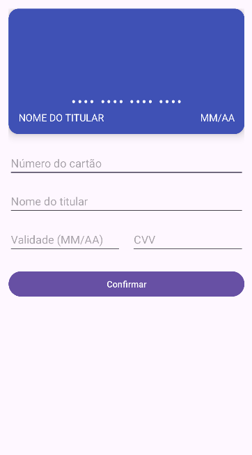

# Cartão de Crédito (Kotlin)

> 🚧 Projeto em desenvolvimento — este README será atualizado conforme as funcionalidades forem implementadas.

Aplicativo Android em **Kotlin**, com **ConstraintLayout**, simulando a interface de um cartão de crédito.

## Feito até agora

- Layout inicial: `CardView` de frente e verso sobrepostas (verso oculto, já preparado para o flip do Desafio 1).
- Formulário com campos: número do cartão, nome do titular, validade e CVV.
- Botão Confirmar.

## Pendente

- Máscaras automáticas (espaço a cada 4 dígitos no número, formato MM/AA na validade).
- Validação (16 dígitos no número, nome com 3+ caracteres).
- Desafio 1: flip do cartão ao focar no campo CVV.
- Desafio 2: identificação dinâmica da bandeira (Visa, Mastercard, etc).

## Captura de tela (estado atual)

## Autor

Gustavo Nunes Melo
